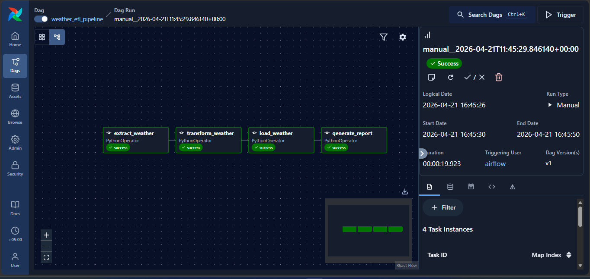

# Weather ETL Pipeline — Apache Airflow + Docker

A hands-on project demonstrating a complete **Extract → Transform → Load** pipeline
using **Apache Airflow 3.2.0** running in Docker with CeleryExecutor. No API keys required.

---

## Table of Contents

1. [What This Project Does](#what-this-project-does)
2. [Prerequisites](#prerequisites)
3. [Project Structure](#project-structure)
4. [Step-by-Step Setup](#step-by-step-setup)
5. [Running the Pipeline](#running-the-pipeline)
6. [Viewing the Output](#viewing-the-output)
7. [Understanding the DAG Code](#understanding-the-dag-code)
8. [Output Data Schema](#output-data-schema)
9. [Troubleshooting](#troubleshooting)
10. [Stopping the Project](#stopping-the-project)

---

## What This Project Does

```
Open-Meteo Weather API  (free, no API key)
           │
           ▼
    ┌─────────────┐
    │   EXTRACT   │  Fetches 7-day hourly forecast for 4 cities
    └──────┬──────┘  → saves raw_weather.json
           │
           ▼
    ┌─────────────┐
    │  TRANSFORM  │  Aggregates hourly data into daily summaries
    └──────┬──────┘  → saves daily_weather_summary.csv
           │
           ▼
    ┌─────────────┐
    │    LOAD     │  Writes final data into SQLite database
    └──────┬──────┘  → saves weather.db
           │
           ▼
    ┌─────────────┐
    │   REPORT    │  Prints a formatted summary to the task logs
    └─────────────┘
```

**Cities covered:** Karachi · London · New York · Tokyo



---

## Prerequisites

Make sure the following are installed before starting:

| Tool | How to check | Download |
|------|-------------|----------|
| Docker Desktop | `docker --version` | https://www.docker.com/products/docker-desktop |
| Docker Compose | `docker compose version` | Included with Docker Desktop |
| Python 3.x (local) | `python --version` | Only needed to generate the Fernet key |
| Git (optional) | `git --version` | https://git-scm.com |

> **Windows users:** Docker Desktop requires **WSL 2**. Enable it via:
> `wsl --install` in PowerShell (run as Administrator), then restart.

> **Minimum resources:** Airflow 3 with CeleryExecutor requires at least **4 GB RAM** and **2 CPUs** allocated to Docker.

---

## Project Structure

```
weather-airflow-docker-etl/
│
├── docker-compose.yaml          # Defines all Airflow 3 services (API server, scheduler,
│                                #   dag-processor, worker, triggerer, Redis, Postgres)
├── Dockerfile                   # Custom Airflow 3.2.0 image with pandas & requests
├── .env                         # Required secrets (FERNET_KEY, AIRFLOW_UID) — not in git
├── README.md                    # This file
│
├── dags/
│   └── weather_etl_dag.py       # The ETL pipeline — 4 tasks
│
├── data/                        # Output files written here (mounted into all containers)
│   ├── raw_weather.json         # Created after Extract task runs
│   ├── daily_weather_summary.csv# Created after Transform task runs
│   └── weather.db               # Created after Load task runs
│
├── logs/                        # Airflow task execution logs
├── config/                      # Airflow config overrides
└── plugins/                     # Custom Airflow plugins (empty for now)
```

---

## Step-by-Step Setup

### Step 1 — Clone or download the project

```bash
git clone <repo-url>
cd weather-airflow-docker-etl
```

### Step 2 — Create the `.env` file

Airflow 3 requires a **Fernet key** (used to encrypt connections) and an **AIRFLOW_UID** for file ownership. Create the `.env` file in the project root:

```bash
# Generate a Fernet key (run this command, then copy the output)
python -c "from cryptography.fernet import Fernet; print('FERNET_KEY=' + Fernet.generate_key().decode())"
```

Create `.env` with the output:

```
FERNET_KEY=<paste-your-generated-key-here>
AIRFLOW_UID=50000
```

> On Linux, replace `50000` with your actual UID: `echo "AIRFLOW_UID=$(id -u)" >> .env`

### Step 3 — Verify Docker is running

```bash
docker --version
# Expected: Docker version 24.x.x or higher

docker compose version
# Expected: Docker Compose version v2.x.x
```

If Docker is not running, open **Docker Desktop** and wait for the whale icon to stop animating.

### Step 4 — Build the custom image

```bash
docker compose build
```

This builds a custom image based on `apache/airflow:3.2.0-python3.11` with `pandas` and `requests` pre-installed. Only needed once (or after changing the Dockerfile).

### Step 5 — Initialize the database

```bash
docker compose up airflow-init
```

This runs a one-time setup service that:
- Migrates the Airflow metadata database (PostgreSQL)
- Creates the default admin user (`airflow` / `airflow`)

Wait for it to exit cleanly (you'll see `Exited (0)` in the logs).

### Step 6 — Start all services

```bash
docker compose up -d
```

This starts 7 services:

| Service | Role |
|---------|------|
| `postgres` | Airflow metadata database |
| `redis` | Celery message broker |
| `airflow-apiserver` | Web UI + REST API (port 8080) |
| `airflow-scheduler` | Schedules DAG runs |
| `airflow-dag-processor` | Parses and validates DAG files |
| `airflow-worker` | Executes tasks (CeleryExecutor) |
| `airflow-triggerer` | Handles deferrable operators |

**Wait about 60–90 seconds** for all services to become healthy.

### Step 7 — Confirm services are healthy

```bash
docker compose ps
```

Expected output:

```
NAME                                     STATUS
<project>-postgres-1                     running (healthy)
<project>-redis-1                        running (healthy)
<project>-airflow-apiserver-1            running (healthy)
<project>-airflow-scheduler-1            running (healthy)
<project>-airflow-dag-processor-1        running (healthy)
<project>-airflow-worker-1               running (healthy)
<project>-airflow-triggerer-1            running (healthy)
<project>-airflow-init-1                 Exited (0)
```

> `airflow-init` showing `Exited (0)` is **normal** — it runs once to initialize, then exits cleanly.

---

## Running the Pipeline

### Step 8 — Open the Airflow UI

Open your browser and go to:

```
http://localhost:8080
```

Login with:
- **Username:** `airflow`
- **Password:** `airflow`

> In Airflow 3, the UI is served by the **API Server** (`airflow-apiserver`), not a traditional webserver. The REST API is also available at the same port under `/api/v2/`.

### Step 9 — Find the DAG

On the **DAGs** page you will see **`weather_etl_pipeline`**.

> If the DAG is not visible yet, wait 30 seconds and refresh. The `dag-processor` service parses DAG files periodically.

### Step 10 — Enable the DAG

Click the **toggle switch** on the left side of the DAG row to turn it **ON** (it turns blue).

### Step 11 — Trigger a manual run

1. Click on the DAG name **`weather_etl_pipeline`** to open it
2. Click the **▶ Trigger DAG** button (top right)
3. Click **Trigger** to confirm

### Step 12 — Watch the pipeline execute

In the **Graph View**, you will see 4 task boxes executing in sequence:

```
extract_weather  →  transform_weather  →  load_weather  →  generate_report
```

Colors indicate status:
- **Light green (running)** — task is currently executing
- **Dark green (success)** — task completed successfully
- **Red (failed)** — task failed (click it → View Logs to debug)

The full pipeline takes about **15–30 seconds** to complete.

### Step 13 — View task logs

Click on any task box → **Log** to see detailed output, including the final weather summary in the `generate_report` log.

---

## Viewing the Output

After a successful run, three output files are created in the `data/` folder on your host machine.

### View the raw JSON (extracted data)

```bash
# Mac/Linux:
head -60 data/raw_weather.json

# Windows (PowerShell):
Get-Content data\raw_weather.json | Select-Object -First 60
```

### View the CSV (transformed data)

```bash
# Mac/Linux:
cat data/daily_weather_summary.csv

# Windows (PowerShell):
Get-Content data\daily_weather_summary.csv
```

Expected columns:
```
date,city,avg_temp_c,max_temp_c,min_temp_c,total_precip_mm,avg_windspeed,avg_humidity,weather_label,pipeline_run_at
```

### Query the SQLite database (loaded data)

```bash
# From the host (requires sqlite3 installed):
sqlite3 data/weather.db "SELECT city, date, avg_temp_c, weather_label FROM daily_weather ORDER BY city, date;"

# Via Docker (works everywhere):
docker compose exec airflow-worker sqlite3 /opt/airflow/data/weather.db \
  "SELECT city, date, avg_temp_c, weather_label FROM daily_weather ORDER BY city, date;"
```

---

## Understanding the DAG Code

Open [dags/weather_etl_dag.py](dags/weather_etl_dag.py) and follow along:

### DAG Definition
```python
with DAG(
    dag_id="weather_etl_pipeline",
    schedule="@daily",     # Runs automatically once per day (Airflow 3 syntax)
    catchup=False,         # Don't backfill missed runs
    ...
) as dag:
```

> In Airflow 3, `schedule_interval` was replaced by `schedule`.

### Operator Import (Airflow 3)
```python
# Airflow 3: operators moved to the standard provider
from airflow.providers.standard.operators.python import PythonOperator
```

### Task 1 — Extract
```python
extract = PythonOperator(
    task_id="extract_weather",
    python_callable=extract_weather,
)
```
Calls `requests.get()` against the Open-Meteo API for each city and atomically writes raw JSON to `data/raw_weather.json`.

### Task 2 — Transform
```python
transform = PythonOperator(
    task_id="transform_weather",
    python_callable=transform_weather,
)
```
Uses `pandas` to group hourly records by date and compute daily statistics, then atomically writes `data/daily_weather_summary.csv`.

### Task 3 — Load
```python
load = PythonOperator(
    task_id="load_weather",
    python_callable=load_weather,
)
```
Uses `pandas.to_sql()` to write the cleaned DataFrame into a SQLite table (`data/weather.db`).

### Task 4 — Report
```python
report = PythonOperator(
    task_id="generate_report",
    python_callable=generate_report,
)
```
Reads from SQLite and prints a per-city summary to the task logs.

### Task Dependencies
```python
extract >> transform >> load >> report
```
The `>>` operator defines execution order. Each task only starts after the previous one succeeds.

---

## Output Data Schema

Table name: `daily_weather` (in `weather.db`)

| Column | Type | Description |
|--------|------|-------------|
| `date` | DATE | Forecast date |
| `city` | TEXT | City name |
| `avg_temp_c` | FLOAT | Average temperature (°C) |
| `max_temp_c` | FLOAT | Maximum temperature (°C) |
| `min_temp_c` | FLOAT | Minimum temperature (°C) |
| `total_precip_mm` | FLOAT | Total precipitation (mm) |
| `avg_windspeed` | FLOAT | Average wind speed (km/h) |
| `avg_humidity` | FLOAT | Average relative humidity (%) |
| `weather_label` | TEXT | Rainy / Hot / Cold / Mild |
| `pipeline_run_at` | TEXT | UTC timestamp of pipeline run |

---

## Troubleshooting

### DAG not appearing in the UI
```bash
# Check dag-processor logs for import errors
docker compose logs airflow-dag-processor | grep ERROR
```

### A task turns red (failed)
1. Click the red task box in Graph View
2. Click **Log**
3. Scroll to the bottom to see the error message

### `FERNET_KEY` not set error on startup
Make sure your `.env` file exists in the project root and contains a valid `FERNET_KEY`. Re-generate one if needed:
```bash
python -c "from cryptography.fernet import Fernet; print('FERNET_KEY=' + Fernet.generate_key().decode())"
```

### Port 8080 already in use
Edit `docker-compose.yaml` and change `"8080:8080"` to `"8081:8080"`, then access the UI at `http://localhost:8081`.

### Services not starting / unhealthy
```bash
# View all service logs
docker compose logs

# Restart everything cleanly
docker compose down
docker compose build
docker compose up airflow-init
docker compose up -d
```

### Reset everything (wipe DB and start fresh)
```bash
docker compose down -v        # -v removes the postgres volume
rm -f data/*.json data/*.csv data/*.db
docker compose up airflow-init
docker compose up -d
```

---

## Stopping the Project

```bash
# Stop containers but keep data
docker compose stop

# Stop and remove containers (keeps the postgres volume)
docker compose down

# Stop, remove containers AND delete all data (full reset)
docker compose down -v
```
